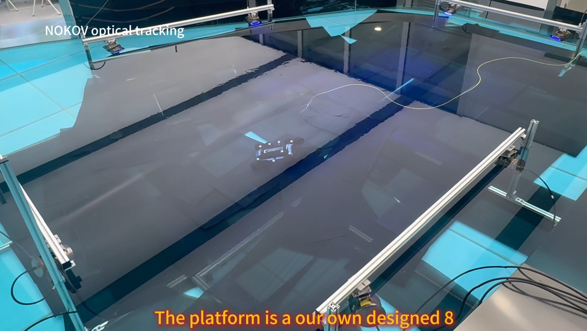
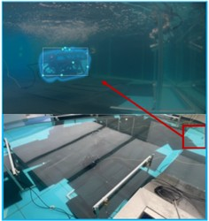

<!-- =====================================================================
     项目优先研究员主页 — 基于 CV 真实信息填充
======================================================================== -->

# 👋 About Me

I am **Yuer Gao (高玉儿)**, a Ph.D. student in Smart Manufacturing at
[The Hong Kong University of Science and Technology (Guangzhou)](https://www.hkust-gz.edu.cn/),
advised by [**Prof. Yi Cai**](https://sites.google.com/view/hkust-gz-yicai/home).

My research focuses on **marine robotics and underwater autonomy** — I build systems that let robots
**perceive, plan, and act** in visually degraded, hydrodynamically complex underwater environments.
Specifically, I work on **disturbance-aware motion planning**, **robust underwater perception and state estimation**,
**vision-language models for marine inspection**, and **real-robot deployment** with ROS-based platforms.

📄 [**CV**](/files/CV.pdf) &nbsp;·&nbsp;
✉️ [**Email**](mailto:ygao438@connect.hkust-gz.edu.cn) &nbsp;·&nbsp;
🎓 [**Google Scholar**](https://scholar.google.com/citations?user=PwHsHYgAAAAJ) &nbsp;·&nbsp;
💻 [**GitHub**](https://github.com/Insomnia813)

<!-- ↓ Hero 视觉：替换为你最强的水下机器人 / 重建画面（GIF 或 JPG）
     建议尺寸：宽度 ~900px，GIF < 3MB -->

  
   
  <em>Disturbance-aware underwater reconstruction with an over-actuated ROV.</em>

# 📢 News

* **2026.05**: 📤 Submitted **CoralVLM** (vision-language benchmark for coral reef inspection) to *IEEE RA-L*.
* **2026.05**: 📝 **Operator-in-the-loop coral inspection** with shared autonomy under review at *IEEE TASE*.
* **2026.04**: 📝 **Bidirectionally coupled path planning** for 3D underwater navigation under review at *IEEE JOE*.
* **2026.01**: 📝 **Disturbance-aware motion planning** for over-actuated ROVs under review at *IEEE/ASME TMECH*.
* **2025.07**: 🎉 Paper on **real-time underwater pose estimation** via vision–optical fusion accepted by **IEEE RA-L**!
* **2025.05**: 🎉 **MULoc** (robust monocular underwater localization) accepted by **IEEE CASE 2025**!
* **2024.11**: 🏆 **Model Mark Competition — Third Prize**, HKUST(GZ), Team Leader.
* **2024.07**: 🎤 Presented **minimum-snap trajectory optimization** for underwater manipulators at **ICARM 2024**!
* **2023.09**: 🚀 Started my Ph.D. at HKUST(GZ), Cyber-physical Interaction Lab.

# 🚀 Selected Projects

<!-- 每个 project：teaser 图 + 名字 + 定位 + 说明 + 链接
     准备好 teaser 图后取消注释 img 标签 -->

---

### 🎯 Disturbance-Aware Underwater Autonomy &nbsp;<small>· TMECH Under Review + TASE Under Review</small>

[teaser](../images/disturbance_aware_teaser.png)

* Over-actuated underwater vehicles (e.g., 8-thruster ROVs) have **redundant actuation** — we exploit this redundancy
  to suppress sediment resuspension and thruster-induced turbulence during close-range inspection, rather than wasting it.
  Our redundancy-resolving planner reduces target-region particle velocity by **67%** and improves reconstruction RMSE
  by **55%** (1.9 mm vs. 4.3 mm) relative to disturbance-unaware baselines. Validated through **440 real-robot trials**
  with **98.5% reconstruction success**.
* A complementary shared-autonomy framework enables **operator-in-the-loop** coral inspection with instance grounding,
  active 3D anchoring, and disturbance-aware control.
* `Yuer Gao`, T. Xu, Q. Liu, J. Luo, **Yi Cai**.
  &nbsp;[TMECH Under Review] [TASE Under Review]

---

### 🔬 Real-Time Underwater Perception &nbsp;<small>· RA-L 2025 + CASE 2025</small>
[teaser](../images/perception_teaser.jpg)

* **Vision–Optical Fusion (RA-L 2025):** A tightly coupled framework with latent-variable motion models for real-time
  underwater state estimation — achieving **5.65 mm position RMSE** at **62 FPS**, a **6.4× improvement** over vision-only baselines.
* **MULoc (CASE 2025):** A monocular localization framework fusing RGB and geometric depth cues for robust tracking
  under turbidity — **92% tracking success** and **< 1% trajectory-length localization error** at 25 FPS.
* `Yuer Gao`, T. Xu, **Yi Cai**.
  &nbsp;[RA-L 2025] [CASE 2025]

---

### 🪸 CoralVLM &nbsp;<small>· Vision-Language for Coral Reef Inspection · RA-L Submitted</small>

[teaser](../images/coralvlm_teaser.png)

* A **task-oriented vision-language benchmark** for underwater embodied coral reef inspection.
  CoralVLM pairs structured visual reasoning with actionable task planning, bridging the gap between
  general-purpose VLMs and the demands of marine ecosystem monitoring.
* `Yuer Gao`, Y. Zhao, **Yi Cai**. *Submitted to IEEE RA-L*.

---

### 🌊 Underwater Navigation in Ocean Currents &nbsp;<small>· JOE Under Review</small>

[teaser](../images/navigation_teaser.png) 

* **Bidirectionally coupled global–local path planning** for 3D underwater navigation that accounts for
  ocean current disturbances. The global planner and local planner exchange information bidirectionally,
  enabling efficient, safe navigation in dynamic marine environments.
* `Yuer Gao`, **Yi Cai**. *Under review at IEEE Journal of Oceanic Engineering*.

# 📝 Selected Publications

<!-- 一作论文 -->

<b>First-Author Publications</b>

---

<b>IEEE RA-L, 2025</b>

<!--  -->

* `Yuer Gao`, T. Xu, Y. Cai. ***"Real-Time Millimeter-Accurate Underwater Pose Estimation via Tightly-Coupled Fusion of Vision and Optical Tracking."*** *IEEE Robotics and Automation Letters (RA-L)*, 2025.

---

<b>IEEE/ASME TMECH — Under Review</b>

* `Yuer Gao`, T. Xu, Q. Liu, Y. Cai. ***"Disturbance-Aware Motion Planning for Over-Actuated Underwater Vehicles Exploiting Actuation Redundancy for High-Fidelity 3D Reconstruction."*** *IEEE/ASME Transactions on Mechatronics (TMECH)*. Under review.

---

<b>IEEE CASE, 2025</b>

* `Yuer Gao`, Y. Cai. ***"MULoc: Robust Monocular Visual Localization for Underwater Robots via Multi-modal Feature Fusion."*** *IEEE International Conference on Automation Science and Engineering (CASE)*, 2025.

---

<b>IEEE JOE — Under Review</b>

* `Yuer Gao`, Y. Cai. ***"Bidirectionally Coupled Global–Local Path Planning for 3D Underwater Navigation in Ocean Currents."*** *IEEE Journal of Oceanic Engineering (JOE)*. Under review.

---

<b>IEEE RA-L — Submitted</b>

* `Yuer Gao`, Y. Zhao, Y. Cai. ***"CoralVLM: A Task-Oriented Vision-Language Benchmark Toward Underwater Embodied Coral Reef Inspection."*** *IEEE Robotics and Automation Letters (RA-L)*. Submitted.

---

<b>IEEE TASE — Under Review</b>

* `Yuer Gao`, J. Luo, Y. Cai. ***"Operator-in-the-Loop Underwater Coral Inspection: Instance Grounding, Active 3D Anchoring, and Disturbance-Aware Shared Autonomy."*** *IEEE Transactions on Automation Science and Engineering (TASE)*. Under review.

---

<b>ICARM, 2024</b>

* `Yuer Gao`, T. Xu, Y. Cai. ***"Minimum-Snap Trajectory Optimization for Underwater Manipulator."*** *Proceedings of the International Conference on Advanced Robotics and Mechatronics (ICARM)*, 2024.

---

<b>Frontiers in Neurorobotics, 2022</b>

* `Yuer Gao`, X. Zhang, et al. ***"UVMS Task-Priority Planning Framework for Underwater Task Goal Classification Optimization."*** *Frontiers in Neurorobotics*, 2022.

---

<b>Selected Co-Author Publications</b>

* Z. Liao, W. Wei, L. Zhang, **Y. Gao**, Y. Cai. *"An Augmented Reality-Enabled Digital Twin System for Reconfigurable Soft Robots: Visualization, Simulation and Interaction."* Computers in Industry, 2025.
* Q. Liu, T. Xu, F. Zhan, **Y. Gao**, Z. Liao, Y. Cai. *"Autonomous Magnetically Reconfigurable Soft Gripping System for Adaptive Manipulation in Smart Manufacturing."* Computers & Industrial Engineering, 2026.
* T. Xu, **Y. Gao**, Y. Cai. *"AI-Based Structural Feature Recognition for Robotic Grasping of Additive Manufacturing Parts."* FAIM, 2024.
* **Y. Gao**, X. Zhang, Y. Gao, T. Shang, Q. Yang. *"Underwater Manipulator Control Based on Neural Network and Fuzzy Compensation."* Computer Engineering and Applications, 2022. (Chinese Core, CSCD, EI)

# 🌊 Field Deployment & Media

  
  &nbsp;
  
  &nbsp;
  

* **Pool experiments at HKUST(GZ)** — testing perception-planning-control pipelines in a controlled tank with real ROV hardware.
* **440 real-robot trials** — disturbance-aware reconstruction validated under visually degraded and hydrodynamically challenging conditions.
* **ROS-based platform** — integrated state estimation, localization, and motion planning modules on an 8-thruster over-actuated ROV.

*Photos coming soon — preparing deployment visuals from recent experiments.*

# 🎓 Education

<!-- 把对应学校的 logo 放到 images/ 目录下，取消注释 img 标签 -->

> <!--  --> **The Hong Kong University of Science and Technology (Guangzhou)**
>
> > * **Ph.D. in Smart Manufacturing** ——— *2023 – Present (Expected Dec. 2026)*
> >   GPA: 3.5 / 4.0 &nbsp;·&nbsp; Supervised by [Prof. Yi Cai](https://sites.google.com/view/hkust-gz-yicai/home)

> <!--  --> **Xi'an University of Technology**
>
> > * **M.S. in Control Science and Engineering** ——— *2020 – 2023*
> >   GPA: 4.4 / 5.0

> <!--  --> **Xi'an University of Technology**
>
> > * **B.E. in Automation** ——— *2017 – 2021*
> >   GPA: 4.2 / 5.0 &nbsp;·&nbsp; Top 3%

# 🏅 Honors & Awards

* *2024* — **Model Mark Competition — Third Prize**, HKUST(GZ) (Team Leader)
* *2022* — **National Scholarship (Graduate)** (awarded twice), Ministry of Education, China
* *2022* — **China Robotics & Artificial Intelligence Competition — First Prize**
* *2021* — **Internet+ Innovation and Entrepreneurship Competition — Gold & Bronze Awards**

# 💬 Academic Services

### Reviewer

* **Ocean Engineering**
* **IEEE International Conference on Robotics and Automation (ICRA)**
* **IEEE/RSJ International Conference on Intelligent Robots and Systems (IROS)**

### Teaching

* Teaching Assistant — *UCMP 6010: Cross-disciplinary Research Methods*, HKUST(GZ)

### Mentoring

* Evaluator / Mentor — **Red Bird Challenge**, HKUST(GZ): Selected and evaluated prospective MPhil students during a two-week intensive selection camp.
